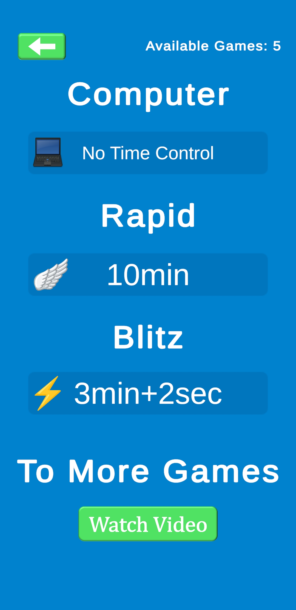
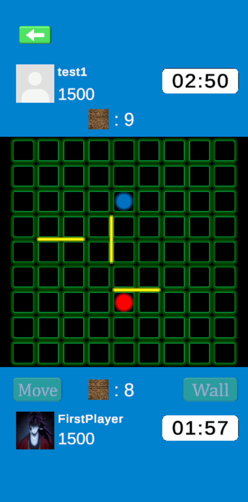
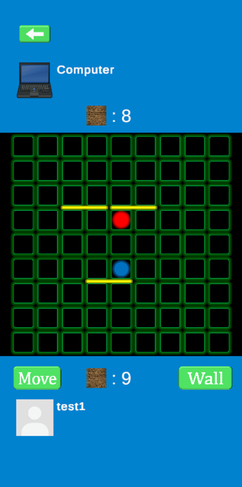
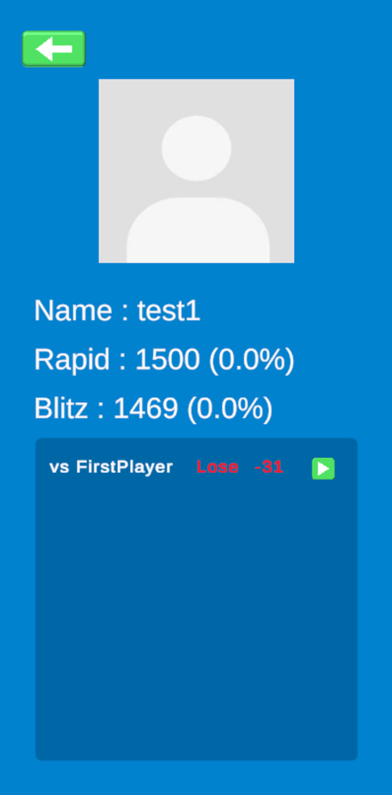

# Valhalla of Quoridor

A multiplayer Quoridor game application with real-time matchmaking, friend system, and AI opponents.

## Dependencies

**Back-end**: FastAPI, SQLite, SQLAlchemy, Uvicorn, WebSocket, JWT, BCrypt

**Front-end**: Unity 2021.3, C#, Unity UI, TextMeshPro

**Infrastructure**: AWS EC2, Nginx, SSL/TLS (Let's Encrypt)

**External APIs**: Gmail API (Email verification), Unity IAP, Google Mobile Ads

## Project Structure

```
for_github/
├── Server/                 # FastAPI Backend
│   ├── main.py            # Main FastAPI application
│   ├── User.py            # User models and authentication
│   ├── email_sender.py    # Email verification system
│   ├── quoridor_ai.py     # AI opponent logic
│   ├── static/            # Static files
│   └── .env.example       # Environment variables template
│
└── Client(Unity)/         # Unity Client Scripts
    └── *.cs               # C# scripts for Unity game client
```

## Features

- **User Authentication**: JWT-based authentication with email verification
- **Friend System**: Send/accept friend requests, view friends list
- **Real-time Chat**: WebSocket-based chat with friends
- **Matchmaking**: Rapid and Blitz game modes with ELO rating
- **AI Opponent**: Play against AI with multiple difficulty levels
- **Game History**: Track and replay past games
- **Profile Management**: Customize profile with image upload

## Screenshots

     
